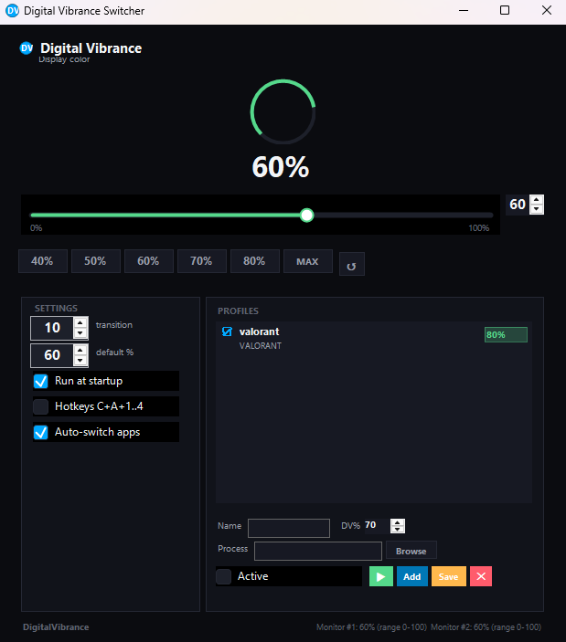

<div align="center">
  
  
  
  <br/>
  
  
  
</div>

<br/>

<h1 align="center">🎨 Digital Vibrance Switcher</h1>

<div align="center">
  
</div>

> ⚙️ **Instant NVIDIA Digital Vibrance control — no more waiting for the Control Panel.**
> ⚙️ **Controla el Digital Vibrance de tu GPU NVIDIA al instante. Olvídate del Panel de Control.**

---

# 🌐 Language — Idioma

<details open>
<summary>🇬🇧 English — click for English version / clic para la versión en inglés</summary>

---

## 🔥 The Problem

You're mid-game and the colors feel **washed out**. Or you're editing a photo and the saturation feels **off**. You know the drill:

1. Open **NVIDIA Control Panel** _(10-20 seconds just loading)_
2. Navigate to "Adjust desktop color settings"
3. Wait for it to render _(another 5 seconds)_
4. Move the **Digital Vibrance** slider
5. Click **"Apply"**
6. Go back to what you were doing

**20-30 seconds** for something that should take **one click**.

And it's not just about speed — **different apps look best at different vibrance levels**. Maybe:

- 🎮 **Gaming**: 70-100% for punchy, vibrant colors
- 🎬 **Movies**: 50-60% for natural skin tones
- 📝 **Work/design**: 40-50% for accurate colors
- 🌙 **Night time**: lower vibrance so your eyes don't burn

With this tool, you **set a profile per app** and it **switches automatically** — no more manual tweaking every time you tab out.

## ✅ The Solution

**Digital Vibrance Switcher** talks directly to NVIDIA's driver API (`nvapi64.dll`) to change the value **instantly** — no Control Panel, no waiting, no clicking Apply.

| Task | NVIDIA CP | **This app** |
|------|-----------|--------------|
| Change vibrance | ~25 sec | ⚡ **instant** |
| Switch presets | full navigation | **1 click** |
| From any app | alt+tab → wait | **global hotkey** |

## ✨ Features

| Feature | Description |
|---------|-------------|
| 🎚 **Precision slider** | Drag to any value from 0-100% with live preview |
| ⚡ **Quick presets** | One-click: 40%, 50%, 60%, 70%, 80%, MAX |
| ⌨️ **Global hotkeys** | `Ctrl+Alt+1/2/3/4` from **any app**, even fullscreen games |
| 🖥 **System tray** | Minimizes to tray, dark-themed context menu |
| 🚀 **Auto-start** | Launches with Windows, restores your last value |
| 🎨 **Dark theme** | Modern, clean UI with consistent dark palette |
| 🔄 **Real-time feedback** | Circular arc indicator shows current value |
| 📊 **Multi-monitor aware** | Detects all your NVIDIA displays |
| 📝 **App profiles** | Per-application vibrance profiles with auto-switch |
| 🎯 **Auto-switch** | Detects foreground app and switches vibrance instantly |
| 🔍 **App Browse** | Built-in selector for installed apps (Steam, Epic, Riot, Valorant, etc.) with search and loading spinner |
| 💾 **Default value** | Configurable fallback value when leaving a profiled app |
| 🔎 **Fuzzy matching** | Profile "VALORANT" matches "VALORANT-Win64-Shipping" automatically |
| 🌙 **Dark tray menu** | Context menu styled with dark theme, no more white column |

## ⌨️ Hotkeys

Work **globally** — in games, fullscreen apps, anywhere. Change vibrance without even tabbing out.

| Keys | Action |
|------|--------|
| `Ctrl` + `Alt` + `1` | **50%** |
| `Ctrl` + `Alt` + `2` | **60%** |
| `Ctrl` + `Alt` + `3` | **70%** |
| `Ctrl` + `Alt` + `4` | **80%** |

## 📦 Installation

**Quick start:**
1. Download the latest `DigitalVibrance.exe` from [Releases](https://github.com/jbotgil/digital-vibrance-switcher/releases)
2. **Double-click** the `.exe` — no installation needed
3. The app opens and **immediately applies** the last used vibrance value
4. Use the **slider** or click a **preset** to change
5. Close the window → it **minimizes to tray** (it keeps running)
6. To reopen: **double-click the tray icon** or right-click → "Show Window"
7. To exit completely: right-click tray icon → **"Exit"**

The app **remembers** your last value and restores it on next launch.

### Requirements
- **Windows 10 or 11** (64-bit)
- **NVIDIA GPU** with drivers installed
- **nvapi64.dll** (included with NVIDIA drivers)
- [.NET Framework 4.8](https://dotnet.microsoft.com/en-us/download/dotnet-framework/net48)

### Build from source
```bash
git clone https://github.com/jbotgil/digital-vibrance-switcher.git
cd digital-vibrance-switcher
msbuild DigitalVibranceSwitcher.csproj /p:Configuration=Release /p:Platform=x64
```

## 🔧 How It Works

The app uses **P/Invoke** to call NVIDIA's proprietary API (`nvapi64.dll`) directly:
1. **QueryInterface** → get function pointers for each NVAPI function
2. **NvAPI_Initialize** → establish a session with the driver
3. **NvAPI_EnumPhysicalGPUs** → enumerate available NVIDIA GPUs
4. **NvAPI_GetDVCInfoEx** → read current Digital Vibrance range/values
5. **NvAPI_SetDVCInfoEx** → write new Digital Vibrance value

The change takes effect **immediately** — no driver reload, no display restart, no "Apply" button.

## 📋 Project Status

- ✅ Core NVAPI integration
- ✅ Preset system (quick buttons)
- ✅ Global hotkeys (`Ctrl+Alt+1/2/3/4`)
- ✅ System tray with dark theme
- ✅ Dark theme UI
- ✅ Auto-start with Windows
- ✅ Multi-monitor support
- ✅ Smooth transitions (animated value changes)
- ✅ Per-application profiles
- ✅ Game detection & auto-switching
- ✅ DDC/CI monitor control
- ✅ App Browse picker with search and loading spinner
- ✅ Configurable default vibrance value
- ✅ Fuzzy profile matching (partial process name)
- ✅ Dark tray context menu

## 🤝 Contributing

Contributions are welcome! Open an issue or submit a PR.
1. Fork the repo
2. Create your feature branch (`git checkout -b feature/amazing-idea`)
3. Commit your changes
4. Push to the branch
5. Open a Pull Request

## 📄 License

MIT — see [LICENSE](LICENSE).

</details>

<br/>

<details>
<summary>🇪🇸 Español — haz clic para la versión en español / click for Spanish version</summary>

---

## 🔥 El Problema

Estás jugando y los colores se ven **apagados**. O estás editando una foto y la saturación **no termina de convencerte**. El ritual de siempre:

1. Abrir el **Panel de Control de NVIDIA** _(10-20 segundos solo para cargar)_
2. Ir a "Ajustar configuración de color del escritorio"
3. Esperar a que cargue la página _(otros 5 segundos)_
4. Mover el slider de **Digital Vibrance**
5. Pulsar **"Aplicar"**
6. Volver a lo que estabas haciendo

**20-30 segundos** para algo que debería ser **un solo clic**.

Y no es solo por rapidez — **cada aplicación se ve mejor con un vibrance diferente**:

- 🎮 **Jugando**: 70-100% para colores intensos
- 🎬 **Películas**: 50-60% para tonos de piel naturales
- 📝 **Trabajo/diseño**: 40-50% para colores precisos
- 🌙 **Por la noche**: vibrance bajo para no quemarte los ojos

Con esta herramienta, **creas un perfil por app** y **cambia solo** cuando entras y sales.

## ✅ La Solución

**Digital Vibrance Switcher** se comunica directamente con la API del driver NVIDIA (`nvapi64.dll`) para cambiar el valor **al instante** — sin Panel de Control, sin esperas, sin hacer clic en Aplicar.

| Tarea | NVIDIA CP | **Esta app** |
|-------|-----------|--------------|
| Cambiar vibrance | ~25 seg | ⚡ **instantáneo** |
| Cambiar preset | navegación completa | **1 clic** |
| Desde cualquier app | alt+tab → espera | **atajo global** |

## ✨ Características

| Característica | Descripción |
|----------------|-------------|
| 🎚 **Slider de precisión** | Arrastra a cualquier valor de 0-100% con vista previa |
| ⚡ **Presets rápidos** | Un clic: 40%, 50%, 60%, 70%, 80%, MAX |
| ⌨️ **Atajos globales** | `Ctrl+Alt+1/2/3/4` desde **cualquier app**, incluso juegos a pantalla completa |
| 🖥 **Bandeja del sistema** | Se minimiza a la bandeja, menú contextual con tema oscuro |
| 🚀 **Auto-inicio** | Se inicia con Windows, restaura tu último valor |
| 🎨 **Tema oscuro** | UI moderna con paleta oscura consistente |
| 🔄 **Feedback en tiempo real** | Indicador visual de arco con el valor actual |
| 📊 **Multi-monitor** | Detecta todos tus displays NVIDIA |
| 📝 **Perfiles por app** | Perfiles de vibrance por aplicación con cambio automático |
| 🎯 **Auto-detección** | Detecta la app en primer plano y cambia el vibrance al instante |
| 🔍 **Selector de apps** | Explorador integrado que encuentra juegos instalados (Steam, Epic, Riot, Valorant...) con búsqueda y spinner de carga |
| 💾 **Valor por defecto** | Porcentaje configurable al que volver al salir de una app con perfil |
| 🔎 **Coincidencia parcial** | El perfil "VALORANT" matchea automáticamente "VALORANT-Win64-Shipping" |
| 🌙 **Menú oscuro** | Menú contextual de la bandeja sin la franja blanca molesta |

## ⌨️ Atajos de teclado

Funcionan **globalmente** — en juegos, apps a pantalla completa, en cualquier lugar. Cambia el vibrance sin ni siquiera salir de la app.

| Teclas | Acción |
|--------|--------|
| `Ctrl` + `Alt` + `1` | **50%** |
| `Ctrl` + `Alt` + `2` | **60%** |
| `Ctrl` + `Alt` + `3` | **70%** |
| `Ctrl` + `Alt` + `4` | **80%** |

## 📦 Instalación

**Inicio rápido:**
1. Descarga el último `DigitalVibrance.exe` desde [Releases](https://github.com/jbotgil/digital-vibrance-switcher/releases)
2. **Haz doble clic** en el `.exe` — no necesita instalación
3. La app se abre y **aplica inmediatamente** el último valor usado
4. Usa el **slider** o haz clic en un **preset** para cambiar
5. Cierra la ventana → se **minimiza a la bandeja** (sigue funcionando)
6. Para reabrir: **doble clic en el icono de la bandeja** o clic derecho → "Show Window"
7. Para salir: clic derecho en la bandeja → **"Exit"**

La app **recuerda** tu último valor y lo restaura al siguiente inicio.

### Requisitos
- **Windows 10 u 11** (64 bits)
- **GPU NVIDIA** con drivers instalados
- **nvapi64.dll** (incluida con los drivers NVIDIA)
- [.NET Framework 4.8](https://dotnet.microsoft.com/en-us/download/dotnet-framework/net48)

### Compilar desde el código
```bash
git clone https://github.com/jbotgil/digital-vibrance-switcher.git
cd digital-vibrance-switcher
msbuild DigitalVibranceSwitcher.csproj /p:Configuration=Release /p:Platform=x64
```

## 🔧 Cómo funciona

La app usa **P/Invoke** para llamar directamente a la API propietaria de NVIDIA (`nvapi64.dll`):
1. **QueryInterface** → obtener punteros a cada función NVAPI
2. **NvAPI_Initialize** → establecer sesión con el driver
3. **NvAPI_EnumPhysicalGPUs** → enumerar las GPUs NVIDIA disponibles
4. **NvAPI_GetDVCInfoEx** → leer rango/valores actuales de Digital Vibrance
5. **NvAPI_SetDVCInfoEx** → escribir el nuevo valor de Digital Vibrance

El cambio tiene efecto **inmediatamente** — sin recargar el driver, sin reiniciar el display, sin botón "Aplicar".

## 📋 Estado del proyecto

- ✅ Integración NVAPI principal
- ✅ Sistema de presets (botones rápidos)
- ✅ Atajos globales (`Ctrl+Alt+1/2/3/4`)
- ✅ Bandeja del sistema con menú oscuro
- ✅ Interfaz de tema oscuro
- ✅ Inicio automático con Windows
- ✅ Soporte multi-monitor
- ✅ Transiciones suaves (cambios animados)
- ✅ Perfiles por aplicación
- ✅ Detección de juegos y cambio automático
- ✅ Control de monitor DDC/CI
- ✅ Selector de apps instaladas con búsqueda y spinner
- ✅ Valor por defecto configurable
- ✅ Coincidencia parcial de nombres de proceso
- ✅ Menú contextual oscuro sin franja blanca

## 🤝 Contribuciones

¡Las contribuciones son bienvenidas! Abre un issue o envía un PR.
1. Haz fork del repositorio
2. Crea tu rama de funcionalidad (`git checkout -b feature/amazing-idea`)
3. Haz commit de tus cambios
4. Sube los cambios
5. Abre un Pull Request

## 📄 Licencia

MIT — ver [LICENSE](LICENSE).

</details>

---

<div align="center">
  <sub>MIT License · Windows 10/11 · .NET Framework 4.8</sub>
</div>